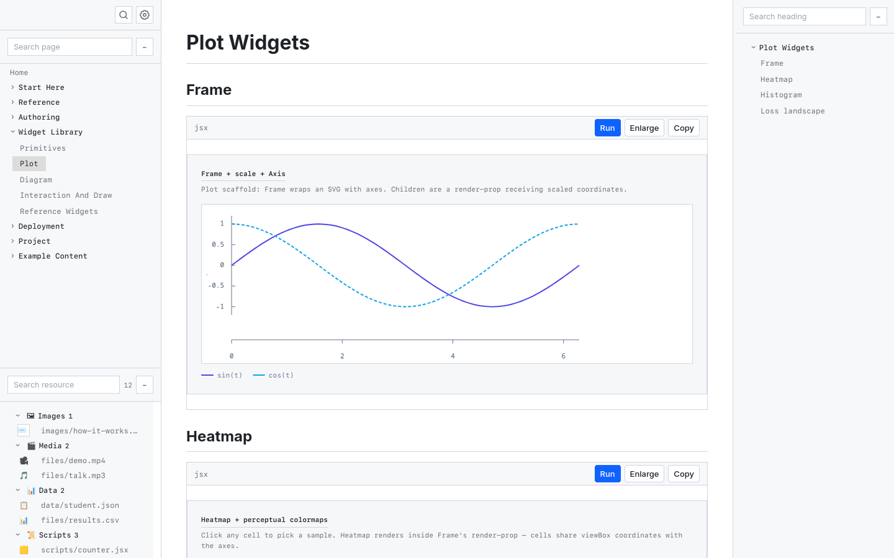

# readrun

[](https://github.com/EdwardAstill/readrun/actions/workflows/ci.yml)

A Bun CLI that turns a folder of Markdown into an interactive website. Plain
notes work without configuration; runnable Python, React widgets, navigation,
search, and static deployment are available when a project needs them.



## What it does

- Serves ordinary `.md` files with navigation, search, tags, backlinks, a table
  of contents, themes, and keyboard shortcuts.
- Runs Python in the browser through Pyodide, with shared page state, automatic
  package detection, uploads, plots, and generated-file downloads.
- Renders inline JSX and bundles project-local React widgets against the
  in-repo `@readrun/widgets` toolkit.
- Embeds CSV, PDF, image, audio, video, STL, GLB, and GLTF files.
- Supports either a curated navigation tree or a wiki built from files and
  `[[wikilinks]]`.
- Produces static output for GitHub Pages, Vercel, and Netlify; Vercel builds
  can add a password gate.

## Quick start

readrun requires [Bun](https://bun.sh).

```bash
bun add --global github:EdwardAstill/readrun

cd your-notes
rr
```

The site opens at `http://localhost:3001`. To explore the bundled example
project instead:

```bash
rr docs
```

No project file is required. A minimal content folder is just Markdown:

```text
notes/
  README.md
  guides/
    getting-started.md
```

Add `.readrun/` only when you need configuration or local assets:

```text
notes/
  .readrun/
    navigation.yaml       # curated tree; omit for filesystem navigation
    entry.txt             # wiki entry page; do not combine with navigation.yaml
    ignore                # project-relative glob patterns
    assets/
      data/               # preloaded into Python
      files/              # documents and media
      images/
      scripts/            # referenced Python or JSX
    widgets/              # source .tsx widgets
```

## Interactive content

Executable blocks use explicit bracket syntax, so the source remains readable
in any Markdown editor.

```text
[python]
import matplotlib.pyplot as plt

plt.plot([1, 4, 2, 5])
plt.show()
[/python]
```

JSX mounts automatically:

```text
[jsx]
function Counter() {
  const [count, setCount] = React.useState(0);
  return <button onClick={() => setCount(count + 1)}>{count}</button>;
}

render(<Counter />);
[/jsx]
```

Longer programs can live in `.readrun/assets/scripts/` and be referenced with
`[python=scripts/analysis.py]` or `[jsx=scripts/chart.jsx]`.

## CLI

| Command | Purpose |
| --- | --- |
| `rr [path]` | Serve a folder or open one Markdown file |
| `rr init [path]` | Create the optional `.readrun/` directories |
| `rr validate [path] --strict` | Check project config, blocks, wikilinks, and assets |
| `rr build <path> [--out=dist]` | Build a static site |
| `rr deploy <host> [path]` | Build and write config for GitHub, Vercel, or Netlify |
| `rr widgets-build [path]` | Bundle `.readrun/widgets/*.tsx` |
| `rr new <page.md>` | Create a Markdown page |
| `rr today [path]` | Open or create today's note |
| `rr clean [path]` | Remove generated site and widget output |
| `rr doctor` | Check the local runtime and bundled docs |

Run `rr --help` or `rr <command> --help` for all options.

## Architecture

```text
Markdown + .readrun assets
          │
          ▼
project discovery → content index → React server rendering
          │                         │
          ├─ development server ────┤─ browser runtime
          └─ static build ──────────┘  (Pyodide + widgets)
```

The source is split into domain, application, infrastructure, presentation,
and widget layers. See the [architecture guide](docs/project/architecture.md)
for the ownership boundaries and runtime flow.

## Development

```bash
bun ci
bun run check
bun run dev
bun run build:docs
```

`bun run check` runs the TypeScript compiler, the Bun test suite, and strict
validation of the bundled docs.

## Documentation

- [Getting started](docs/start/intro.md)
- [Authoring blocks](docs/authoring/blocks.md)
- [Widgets](docs/authoring/widgets.md)
- [Command reference](docs/start/commands.md)
- [Deployment](docs/deployment/overview.md)
- [Known limitations](docs/project/limitations.md)
- [Neovim integration](integrations/nvim/README.md)
